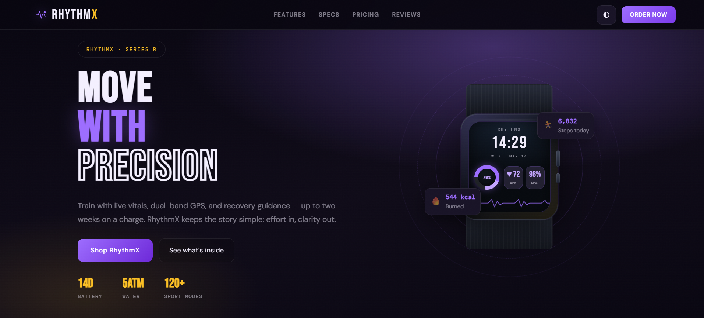
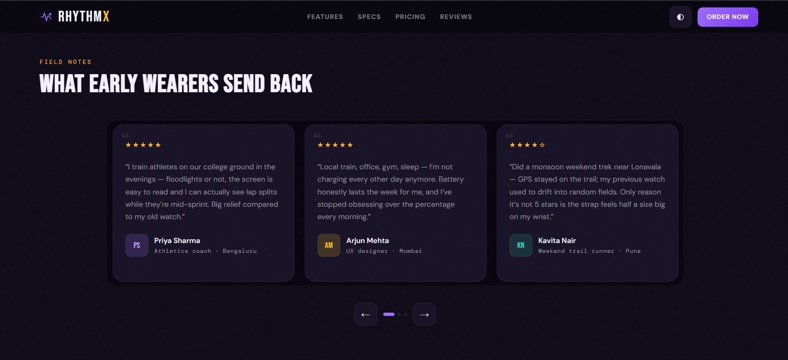

# RhythmX — Smart Fitness Watch Landing Page

> A sleek, fully responsive **front-end landing page** for **RhythmX** — a smartwatch brand built for athletes and everyday movers.

---

## 🌐 About the Website

**RhythmX** is a premium smartwatch brand landing page that showcases the product's features, specifications, pricing tiers, and customer reviews. The page is designed to convert visitors through compelling storytelling, interactive UI elements, and a clean dark-mode-first design.

### What's on the page?

| Section | Description |
|---|---|
| **Hero** | Full-screen intro with a CSS-rendered animated watch face, live clock, and floating stat badges |
| **Features** | Numbered list of 6 key capabilities (HR tracking, GPS, SpO₂, recovery coaching, etc.) |
| **Specs** | Accordion-style spec sheet covering display, sensors, radios, and battery |
| **Pricing** | 3-tier plan cards — Go ($199), Core ($349), Ultra ($499) |
| **Testimonials** | Auto-advancing review slider with real user quotes |
| **Signup** | Email capture form with validation and success state |
| **Footer** | Brand links, navigation columns, and social icons |

---

## 🛠️ Tech Stack

This is a **pure front-end, zero-dependency** project — no frameworks, no build tools, no npm.

| Layer | Technology |
|---|---|
| **Structure** | HTML5 (semantic elements: `<header>`, `<section>`, `<footer>`, `<details>`) |
| **Styling** | Vanilla CSS3 (CSS custom properties, Grid, Flexbox, animations, `@keyframes`) |
| **Interactivity** | Vanilla JavaScript (ES6+, no libraries) |
| **Fonts** | Google Fonts — `Bebas Neue`, `DM Sans`, `DM Mono` |
| **Icons** | Inline SVG + Unicode glyphs |

### Key CSS / JS techniques used

- **CSS custom properties (variables)** for full dark/light theme switching
- **CSS Grid & Flexbox** for all layouts
- **`@keyframes` animations** — floating badges, mesh pulse, watch ring orbit, HRM waveform scroll
- **`IntersectionObserver` API** — fade-in-on-scroll for cards and feature items
- **`localStorage`** — persists user's chosen theme across sessions
- **Responsive design** — mobile hamburger nav, slider adapts columns (1 / 2 / 3) via `window.innerWidth`
- **`<details>` / `<summary>`** — native HTML accordion for the specs section (zero JS needed)

---

## 📁 Project Structure

```
SalesDuo/
├── index.html        # All page markup and structure
├── styles.css        # Full design system — tokens, layout, animations (~42 KB)
├── script.js         # Interactive behaviors — clock, theme, slider, form, scroll
├── screenshots/      # README preview images
└── README.md
```

---

## 🚀 How to Run

Since this is a **static site** (no build step needed), you can run it in multiple ways:

### Option 1 — Open directly in browser *(simplest)*

Just double-click `index.html` or drag it into any modern browser.

> ⚠️ Some browsers restrict `localStorage` on `file://` URLs. Use a local server (options below) for the full theme-persistence experience.

---

### Option 2 — Python local server

```bash
# Python 3
python -m http.server 8000

# Then open → http://localhost:8000
```

---

### Option 3 — Node.js `http-server`

```bash
npx http-server .

# Then open → http://localhost:8080
```

---

### Option 4 — VS Code Live Server

Install the [Live Server](https://marketplace.visualstudio.com/items?itemName=ritwickdey.LiveServer) extension, right-click `index.html` → **Open with Live Server**.

---

## 📸 Screenshots

### Hero Section


### Reviews


---

## ✨ Features at a Glance

- 🌙 **Dark / Light theme toggle** — persisted via `localStorage`
- 📱 **Fully responsive** — hamburger nav on mobile, adaptive slider columns
- ⌚ **Live watch clock** — the hero watch face shows real current time
- 🎠 **Auto-advancing testimonials slider** — pauses on hover, loops back
- ✅ **Email form validation** — inline error messages + success state
- 🎞️ **Scroll animations** — elements fade and slide in as they enter the viewport
- ♿ **Accessible markup** — `aria-label`, `aria-hidden`, semantic HTML throughout

---

## 📝 Notes

- This is a **static front-end demo** — there is no backend, database, or real email integration.
- All images/visuals are pure CSS (the watch face, rings, badges, and waveform are built entirely with CSS and SVG).
- Replace copy, colors, and assets as needed for production deployment.

---

© 2026 RhythmX Labs. Built with ❤️ using plain HTML, CSS & JavaScript.
